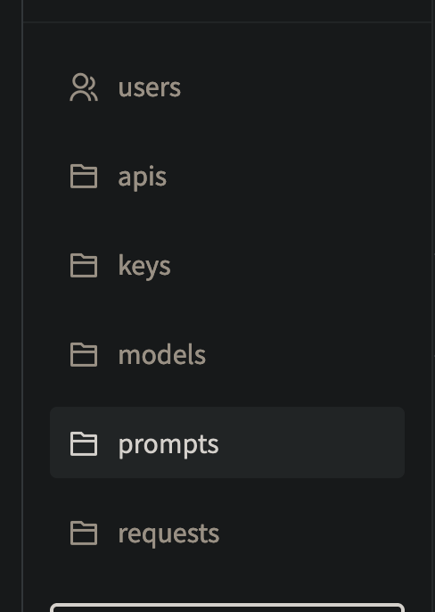
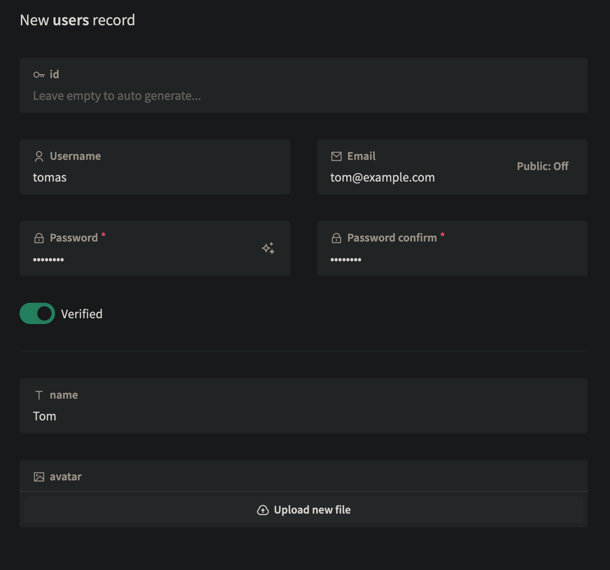
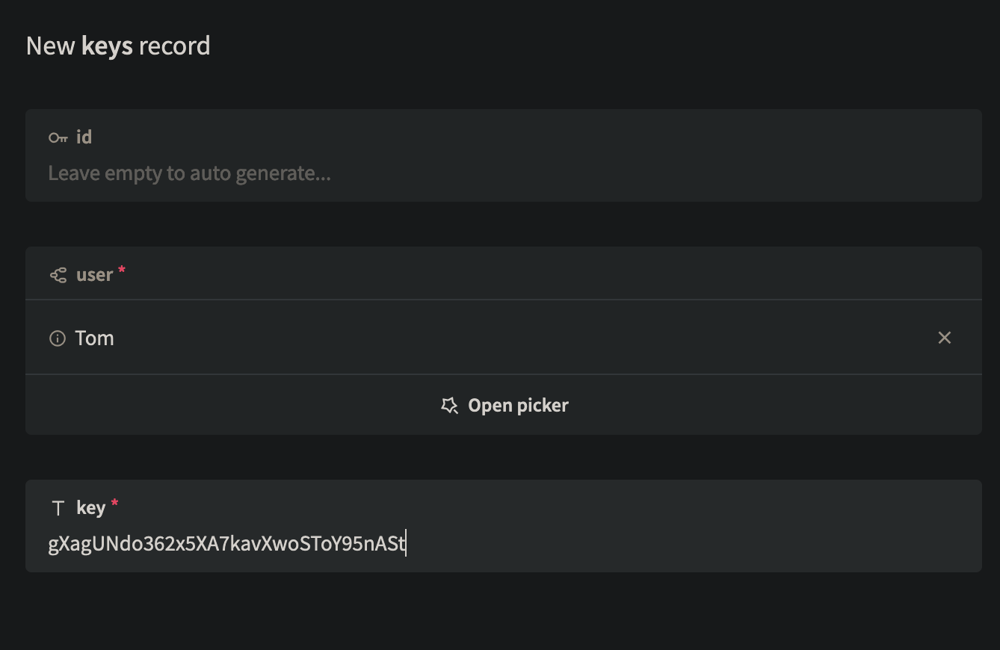
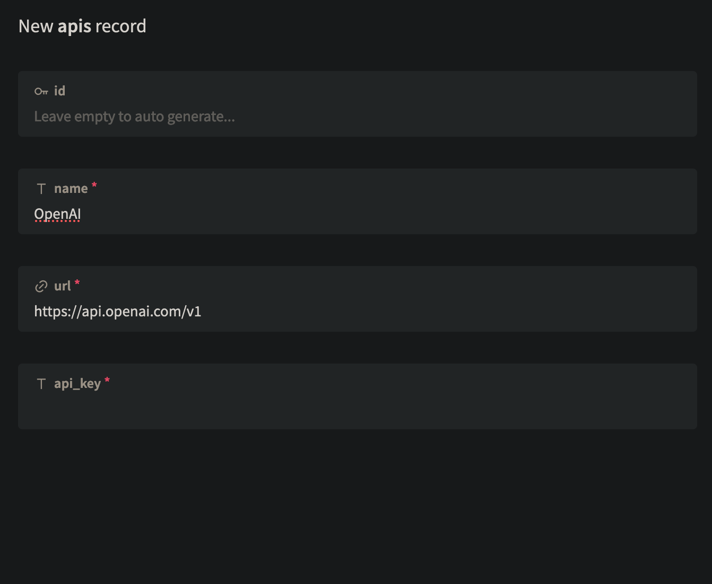
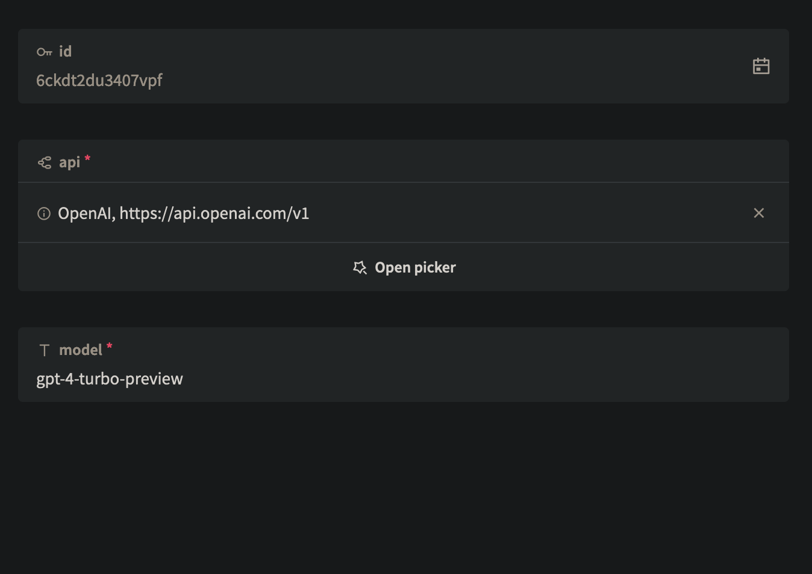
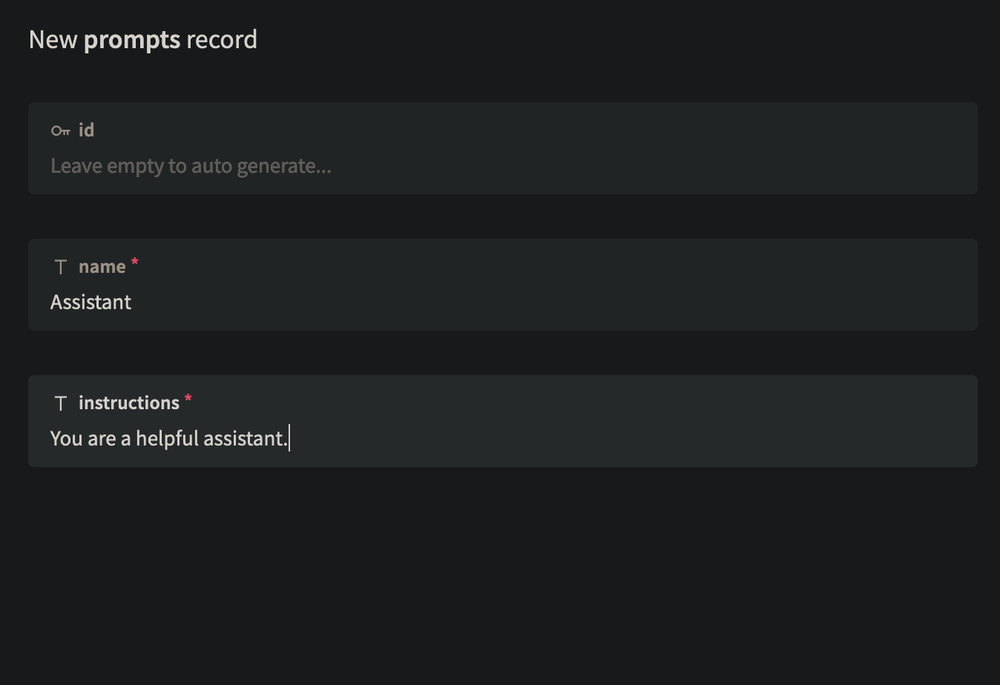

<h1 align="center">PromptProxy</h1>
<p align="center">Call many AIs with many system prompts from a single API.</p>

# Features
* Proxies to any OpenAI Compatible API!
  + [OpenAI API](https://platform.openai.com/docs/overview)
  + [HuggingFace Dedicated Inference Endpoints](https://huggingface.co/docs/inference-endpoints/index)
  + [Ollama](https://github.com/ollama/ollama/blob/main/docs/openai.md)
  + [FastChat](https://github.com/lm-sys/FastChat/blob/main/docs/openai_api.md)
  + [vLLM](https://docs.vllm.ai/en/latest/getting_started/quickstart.html#openai-compatible-server)
  + And many more!
* Store system prompts and use them in your API calls without having to store them in your code.
* System Prompt, AI API, Model, and API key management via PocketBase Admin UI.
* Per user API key management.
* Per user request tracking.
# Roadmap
* [ ] Claude API support
* [ ] Refactor for maintainability
* [ ] Per user rate limits
* [ ] Per user AI access control
* [ ] Per user prompt access control
* [ ] Proper frontend UI
* [ ] Streaming Support
# Setup

```sh
git clone https://github.com/TimeSurgeLabs/promptproxy.git
cd promptproxy
docker build -t timesurgelabs/promptproxy .
docker run -p 8090:8090 -v $(PWD)/pb_data:/pb_data timesurgelabs/promptproxy
```

Then navigate to `http://localhost:8090/_` in your browser. Create an admin account. Now you can see the following tables:



First, create a new user by selecting the users table and hitting "New Record" in the top right. Then, fill out the form, then hit "Create" in the bottom right.



Now that Tom is a user, he needs an API key. Go to the `keys` table and hit "New Record" in the top right. Then, fill out the form, then hit "Create" in the bottom right. I recommend creating a random key using OpenSSL (only works on Git Bash on Windows).

```sh
openssl rand -base64 24
```



After that is done, we need to add some APIs to be used. Currently there is no way to restrict what users use which APIs, however it will track which user used which API and if they used any of the system prompts we store. For this example we're going to use the OpenAI API, however it will work with any API that is OpenAI compatible. Go to the `apis` table and hit "New Record" in the top right. Then, fill out the form, then hit "Create" in the bottom right.



Now you have to add some models. Go to the `models` table and hit "New Record" in the top right. Then, fill out the form, selecting the correct API for the model and filling out the correct model name, then hit "Create" in the bottom right. The new ID of your model will be the model ID you use in the API.



Finally, we can add system prompts! These are prompts used by the API to alter the behavior of the AI models. Go to the `prompts` table and hit "New Record" in the top right. Then, fill out the form, selecting the correct model for the prompt and filling out the correct prompt, then hit "Create" in the bottom right. The new ID of your prompt will be the prompt ID you use in the API. Unlike models, prompts are not linked to specific models or APIs so you can experiment and use the same prompts across multiple models and APIs.



# Usage

You can call the API using the endpoints `/v1/completion` or `/v1/chat/completion` . Rather than putting a model like `gpt-4` , you'll put the database ID of the model. If you want to use a system prompt, put a colon after the model ID and then put the database ID of the prompt.

```sh
curl -X POST "http://localhost:8090/v1/completion" -H "accept: application/json" -H "Content-Type: application/json" -d "{\"model\":\"2nhjz8jg6goy6ll:hl7ssaft143mf8k\",\"prompt\":\"This is a test prompt.\"}"
```

Usage is the same for chat completions, just using `messages` instead of the `prompt` endpoint. Note that for the OpenAI API, the models are not the same for both endpoints.

```sh
curl -X POST "http://localhost:8090/v1/chat/completion" -H "accept: application/json" -H "Content-Type: application/json" -d '{"model":"2nhjz8jg6goy6ll:hl7ssaft143mf8k","messages":[{
      "role": "user",
      "content": "Hola mi nombre es brian y el tuyo?"
    },
    {
      "role": "assistant",
      "content": "spanish"
    },
    {
      "role": "user",
      "content": "Was für ein schönes Baby!"
    },
    {
      "role": "assistant",
      "content": "german"
    },
    {
      "role": "user",
      "content": "Ma voiture est en panne."
    }]}''
```
